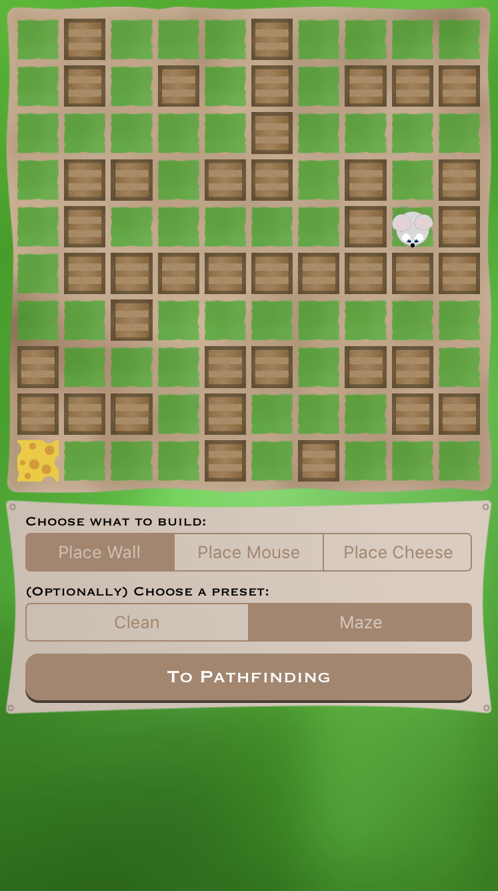
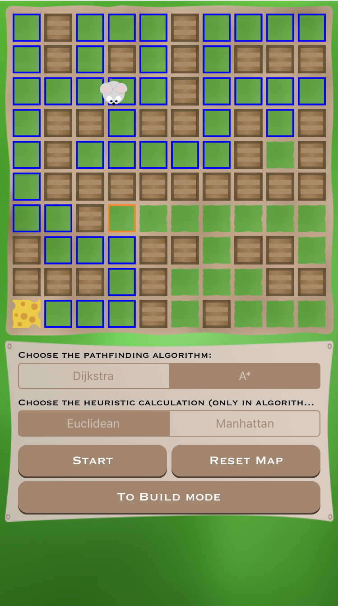

# Pathfinder - Swift Playground

This Swift Playground was created as part of my submission for the WWDC19 scholarships.

The playground contains code that makes use of the Dijkstra and A* algorithms to plan a route through a maze. Next to these two different path planning algorithms, it also implements two heuristic functions (euclidean distance and manhattan distance).

 

---
## How to run?
Open this playground with XCode 10.2 or higher. To view the resulting program, open the `Assistant Editor`.

---
**Status: Accepted 🎉**
